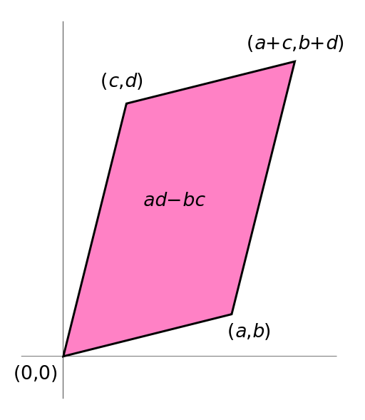


[back to home](https://gaojiabit.github.io/)
# matrix
1. Definition
  - A matrix is a rectangular array of numbers.矩阵就是一个数字的矩形数组。
  - The horizontal and vertical lines of entries in a matrix are called rows and columns, respectively.
  - Overview of a matrix size

| Name	| Size	| Description	|
| :---: | :---:  | :---	|
| Row vector    | 1 x n | A matrix with one row, sometimes used to represent a vector	    |
| Column vector | n x 1 | A matrix with one column, sometimes used to represent a vector	|
| Square matrix | n x n | A matrix with the same number of rows and columns, sometimes used to represent a linear transformation from a vector space to itself, such as reflection, rotation, or shearing.|

2. Basic operations
	- Addition, scalar multiplication, and transposition
	- Matrix multiplication
	- Submatrix  通过删除行或者列的方式获得子矩阵
3. Linear equations
	- inverse matrix 逆矩阵
	- generalized inverse  广义逆
4. Linear transformations
	- Shear mapping  剪裁映射  水平/垂直剪裁
	- Reflection through the vertical axis	反射
	- Squeeze mapping	双曲线旋转
	- Scaling	缩放
	- Rotation	旋转
	- 一个2阶方阵 { TR[a,b],TR[c,d]} 相当于将一个单位正方形变为一个平行四边形
	
5. Square matrix 方阵
	- Main types
		- Diagonal and triangular matrix  对角阵和三角阵
		- Identity matrix 单位阵
		- Symmetric or skew-symmetric matrix 对称和斜对称阵  转置和本身相等或者相反
		- Invertible matrix and its inverse		可逆的和逆矩阵
		- Definite matrix	定矩阵  
			- Positive definite matrix  对角线为正
			- negative-definite		对角线为负
			- Indefinite matrix 非定	含有非正定 非负定的概念
		- Orthogonal matrix 正交矩阵
